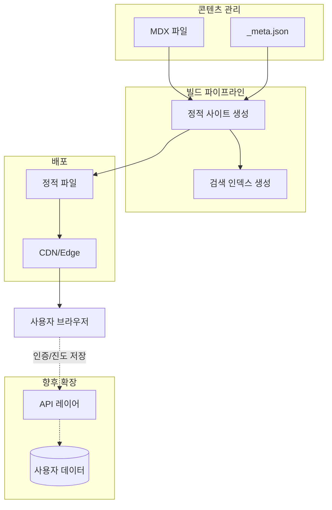
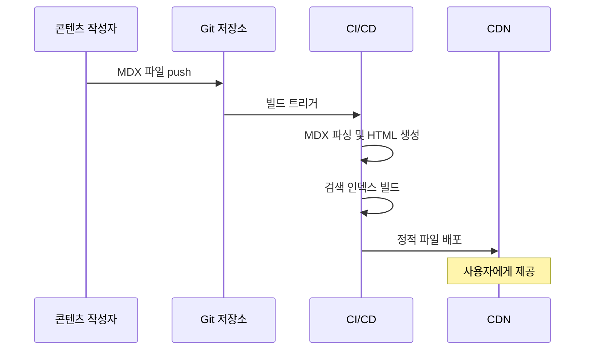

# PostgreSQL 스터디 사이트 - 프로젝트 구조

## 아키텍처 개요

PostgreSQL 스터디 사이트는 콘텐츠 중심의 정적 사이트 생성(SSG) 방식을 기반으로 설계됩니다. 문서 작성자가 Markdown/MDX 파일을 관리하면, 빌드 파이프라인이 최적화된 정적 사이트를 생성합니다.

초기 단계에서는 단순한 구조를 유지하되, 향후 인터랙티브 실습 환경, 사용자 인증, 진도 관리 기능을 추가할 수 있도록 확장 가능한 아키텍처를 목표로 합니다.

```
사용자 브라우저
    |
    v
CDN / 엣지 네트워크 (Vercel / Cloudflare)
    |
    v
정적 웹사이트 (HTML + CSS + JS)
    |
    v (향후 동적 기능)
API 레이어 (Edge Functions / Serverless)
    |
    v
데이터 저장소 (사용자 진도, 북마크 등)
```

---

## 디렉토리 구조

### 최상위 구조

```
postgresql-study/
├── .moai/                    # MoAI-ADK 워크플로우 설정
│   ├── config/               # 품질 설정, 언어 설정
│   ├── project/              # 프로젝트 문서 (product.md, structure.md, tech.md)
│   ├── specs/                # SPEC 문서
│   └── docs/                 # 생성된 문서
├── .claude/                  # Claude Code 에이전트/스킬 설정
├── src/                      # 소스 코드 (프레임워크 선택 후 구체화)
│   ├── app/                  # 애플리케이션 진입점
│   ├── components/           # 재사용 UI 컴포넌트
│   ├── content/              # MDX 콘텐츠 파일
│   ├── styles/               # 전역 스타일
│   └── lib/                  # 유틸리티 및 헬퍼
├── public/                   # 정적 에셋 (이미지, 폰트 등)
├── docs/                     # 개발자 문서
├── tests/                    # 테스트 파일
├── scripts/                  # 빌드/배포 스크립트
├── .github/                  # GitHub Actions CI/CD
├── package.json              # 의존성 및 스크립트
└── README.md                 # 프로젝트 소개
```

### 콘텐츠 구조 (`src/content/`)

콘텐츠는 학습 단계별로 디렉토리를 나누어 관리합니다. 각 MDX 파일은 프론트매터(frontmatter)를 통해 메타데이터를 관리합니다.

```
src/content/
├── _meta.json                # 최상위 네비게이션 순서 정의
├── index.mdx                 # 홈페이지
├── getting-started/          # 시작하기
│   ├── _meta.json
│   ├── what-is-postgresql.mdx
│   ├── installation.mdx
│   └── first-database.mdx
├── basics/                   # SQL 기초
│   ├── _meta.json
│   ├── select.mdx
│   ├── insert-update-delete.mdx
│   ├── where-clause.mdx
│   └── order-limit.mdx
├── data-modeling/            # 데이터 모델링
│   ├── _meta.json
│   ├── tables-and-types.mdx
│   ├── constraints.mdx
│   └── relationships.mdx
├── intermediate/             # 중급 SQL
│   ├── _meta.json
│   ├── joins.mdx
│   ├── aggregates.mdx
│   ├── subqueries-cte.mdx
│   └── window-functions.mdx
├── advanced/                 # 고급 기능
│   ├── _meta.json
│   ├── indexes.mdx
│   ├── transactions.mdx
│   ├── json-jsonb.mdx
│   ├── full-text-search.mdx
│   └── partitioning.mdx
├── practical/                # 실전 패턴
│   ├── _meta.json
│   ├── performance-tuning.mdx
│   ├── explain-analyze.mdx
│   └── real-world-scenarios.mdx
└── reference/                # 레퍼런스
    ├── _meta.json
    ├── data-types.mdx
    ├── functions.mdx
    └── error-codes.mdx
```

### MDX 파일 프론트매터 규약

```yaml
---
title: "PostgreSQL 인덱스 전략"
description: "B-tree, GiST, GIN 인덱스의 차이와 적절한 사용 시점을 알아봅니다"
difficulty: "intermediate"       # beginner | intermediate | advanced
tags: ["index", "performance", "b-tree"]
version: "13+"                   # 최소 지원 PostgreSQL 버전
updated: "2026-02-28"
related:
  - "/advanced/transactions"
  - "/practical/performance-tuning"
---
```

### 컴포넌트 구조 (`src/components/`)

```
src/components/
├── layout/
│   ├── Header.tsx            # 상단 네비게이션
│   ├── Sidebar.tsx           # 좌측 학습 목차
│   ├── TableOfContents.tsx   # 우측 문서 내 목차
│   └── Footer.tsx            # 하단 정보
├── content/
│   ├── CodeBlock.tsx         # 코드 블록 (문법 강조)
│   ├── SQLPlayground.tsx     # 인터랙티브 SQL 실행 환경
│   ├── Callout.tsx           # 주의/팁/정보 강조 박스
│   ├── Diagram.tsx           # ERD/관계 다이어그램
│   └── VersionBadge.tsx      # PostgreSQL 버전 표시
├── navigation/
│   ├── Breadcrumb.tsx        # 현재 위치 표시
│   ├── PrevNext.tsx          # 이전/다음 페이지 이동
│   └── SearchModal.tsx       # 검색 모달
└── ui/
    ├── Button.tsx
    ├── Badge.tsx
    └── Tooltip.tsx
```

---

## 모듈 구성

### 1. 콘텐츠 레이어

콘텐츠 레이어는 MDX 파일과 프론트매터로 구성됩니다. 작성자는 기술적 배경 없이도 콘텐츠를 추가하고 수정할 수 있습니다.

**역할**: 학습 콘텐츠 저장 및 메타데이터 관리
**의존성**: 없음 (순수 파일 기반)
**확장 방법**: 새 MDX 파일을 해당 디렉토리에 추가하고 `_meta.json`에 등록

### 2. UI 컴포넌트 레이어

UI 레이어는 재사용 가능한 컴포넌트로 구성되며, 디자인 시스템의 원자(atom)에서 유기체(organism)까지를 포함합니다.

**역할**: 시각적 표현, 사용자 인터랙션 처리
**의존성**: 스타일 시스템
**확장 방법**: 새 컴포넌트를 `src/components/`에 추가

### 3. 라우팅 레이어

파일시스템 기반 라우팅으로, `src/content/` 디렉토리 구조가 곧 URL 구조가 됩니다.

```
src/content/advanced/indexes.mdx  →  /advanced/indexes
src/content/basics/select.mdx     →  /basics/select
```

### 4. 검색 레이어 (향후)

콘텐츠 빌드 시 검색 인덱스를 생성하고, 클라이언트 사이드에서 실시간 검색을 제공합니다.

**역할**: 전문 검색, 자동완성, 연관 추천
**의존성**: 콘텐츠 레이어, 빌드 파이프라인

### 5. 실습 환경 레이어 (향후)

브라우저 내에서 PostgreSQL 쿼리를 실행할 수 있는 샌드박스 환경입니다. WebAssembly 기반 PostgreSQL 또는 백엔드 API를 통해 구현합니다.

**역할**: 인터랙티브 쿼리 실행, 실행 결과 표시
**의존성**: API 레이어 또는 WebAssembly

---

## 아키텍처 다이어그램

### 전체 시스템 구조



### 콘텐츠 데이터 흐름



---

## 파일 명명 규칙

### 일반 규칙

- **디렉토리**: `kebab-case` 사용 (예: `getting-started/`)
- **MDX 파일**: `kebab-case` 사용 (예: `window-functions.mdx`)
- **컴포넌트**: `PascalCase` 사용 (예: `CodeBlock.tsx`)
- **유틸리티**: `camelCase` 사용 (예: `parseMarkdown.ts`)
- **상수**: `SCREAMING_SNAKE_CASE` 사용 (예: `MAX_RESULTS`)

### 브랜치 전략

```
main          # 프로덕션 배포 브랜치
develop       # 개발 통합 브랜치
feat/xxx      # 기능 개발
fix/xxx       # 버그 수정
content/xxx   # 콘텐츠 추가/수정
docs/xxx      # 개발자 문서 수정
```

---

## 확장성 고려사항

### 단기 확장 (3개월 이내)

- 검색 기능: 빌드 시 FlexSearch 인덱스 생성
- 다크 모드: CSS 변수 기반 테마 시스템
- 코드 복사 버튼: `CodeBlock` 컴포넌트에 통합

### 중기 확장 (3-6개월)

- 인터랙티브 SQL 실습: WebAssembly 기반 PGlite 통합
- 사용자 북마크: localStorage 또는 간단한 백엔드 API
- 다국어 지원: 영어 콘텐츠 추가 (i18n 라우팅)

### 장기 확장 (6개월 이후)

- 사용자 인증 및 진도 관리: NextAuth.js + 데이터베이스
- AI 튜터: LLM API 연동
- 커뮤니티 Q&A: 댓글/질문 시스템

---

최종 수정일: 2026-02-28
문서 버전: 0.1.0 (초기 기획)
