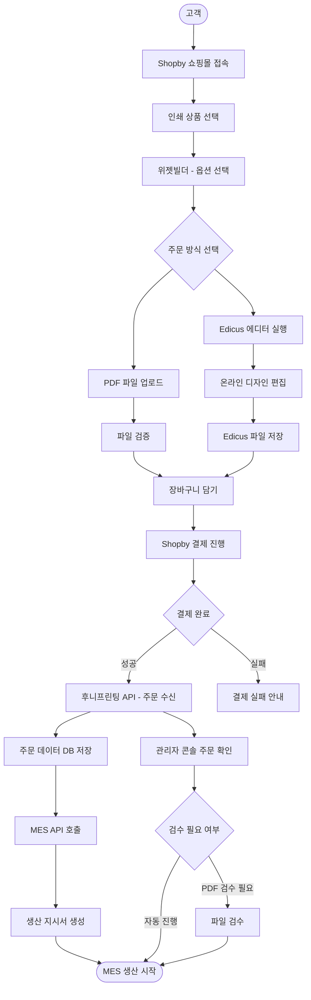
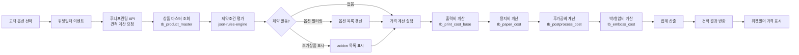
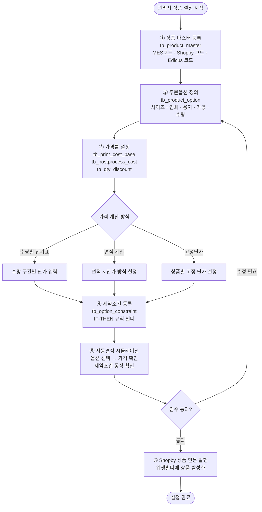
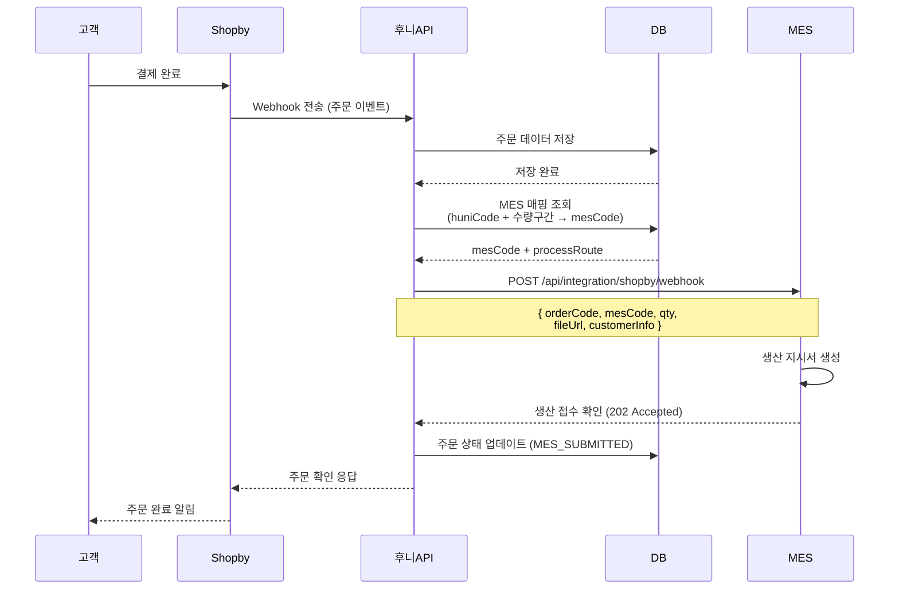
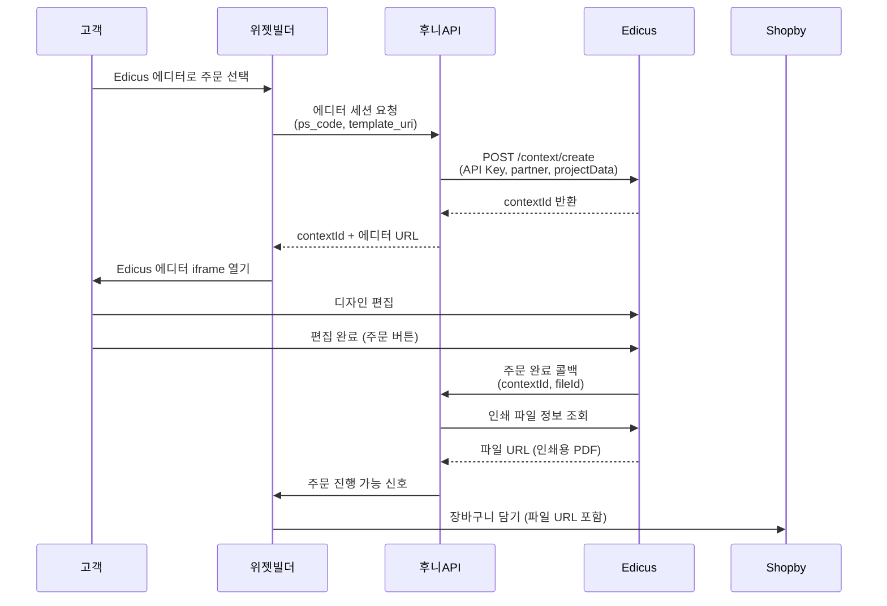

# 후니프린팅 인쇄자동견적 시스템 — 시스템 아키텍처

> **버전**: v1.0 | **작성일**: 2026-03-01
> **참고 문서**: ref/huni/260225_후니프린팅_인쇄자동주문견적시스템설계문서.md

---

## 1. 전체 시스템 아키텍처

```
┌──────────────────────────────────────────────────────────────────────────┐
│                    후니프린팅 인쇄자동견적 시스템 전체 구성                    │
├─────────────────────────────────────────────────────────────────────────┤
│                                                                          │
│  [ 고객 접점 레이어 ]                                                       │
│  ┌──────────────────────┐  ┌───────────────────────────────────────┐    │
│  │   Shopby 쇼핑몰       │  │     후니프린팅 Admin Console             │    │
│  │  (Enterprise 플랫폼)  │  │     (Next.js + Shadcn/ui + Tailwind)  │    │
│  │  ┌────────────────┐  │  │                                       │    │
│  │  │  위젯빌더 (신규)│  │  │  상품관리 │ 가격설정 │ 제약조건빌더    │    │
│  │  │  인쇄옵션 선택  │  │  │  MES매핑 │ 주문조회 │ 자동견적 테스트 │    │
│  │  │  자동견적 표시  │  │  │                                       │    │
│  │  │  주문방식 선택  │  │  └───────────────────────────────────────┘    │
│  │  └────────────────┘  │                                              │
│  └──────────────────────┘                                              │
│          │                                                              │
│  ┌───────▼──────────────────────────────────────────────────────────┐  │
│  │                주문 방식 (2가지)                                     │  │
│  │  ┌─────────────────────────┐  ┌────────────────────────────────┐  │  │
│  │  │     PDF 파일 주문         │  │      Edicus 에디터 주문           │  │  │
│  │  │  고객이 인쇄 파일 직접 업로드│  │  온라인에서 직접 디자인 후 주문    │  │  │
│  │  │  PDF, AI, 고해상도 JPEG   │  │  Edicus JS SDK v2 (MotionOne)   │  │  │
│  │  └─────────────────────────┘  └────────────────────────────────┘  │  │
│  └──────────────────────────────────────────────────────────────────┘  │
│          │                                                               │
│  ┌───────▼──────────────────────────────────────────────────────────┐   │
│  │                  후니프린팅 자체 API Layer                            │   │
│  │                  (Next.js API Routes + Railway)                     │   │
│  │                                                                     │   │
│  │  ┌─────────────┐  ┌─────────────┐  ┌────────────┐  ┌──────────┐  │   │
│  │  │  자동견적 엔진 │  │  Shopby 연동 │  │ Edicus 연동│  │ MES 연동 │  │   │
│  │  │ json-rules  │  │  Webhook 수신│  │  JS SDK 래핑│  │ REST API │  │   │
│  │  │ -engine     │  │  API 호출    │  │  파일 전달   │  │  호출    │  │   │
│  │  └─────────────┘  └─────────────┘  └────────────┘  └──────────┘  │   │
│  └──────────────────────────────────────────────────────────────────┘   │
│          │                                                               │
│  ┌───────▼──────────────────────────────────────────────────────────┐   │
│  │              데이터베이스 (Neon PostgreSQL)                           │   │
│  │  tb_product_master  |  tb_product_option  |  tb_print_cost_base   │   │
│  │  tb_option_constraint  |  tb_addon_group  |  tb_order             │   │
│  │  tb_mes_mapping  |  tb_qty_discount  |  tb_postprocess_cost       │   │
│  └──────────────────────────────────────────────────────────────────┘   │
│          │                                                               │
│  ┌───────▼──────────────────────────────────────────────────────────┐   │
│  │                    외부 시스템 연동                                    │   │
│  │  ┌────────────┐  ┌────────────┐  ┌──────────────┐  ┌──────────┐  │   │
│  │  │   Shopby   │  │   Edicus   │  │ MES (CRT)    │  │ 비즈하우스 │  │   │
│  │  │ Enterprise │  │ Cloud 에디터│  │ .NET WebAPI  │  │ (합판)   │  │   │
│  │  │ (판매/주문) │  │ MotionOne  │  │ api.huniprint│  │ (연동방식 │  │   │
│  │  │            │  │ SDK        │  │ ing.com      │  │  확인 필요)│  │   │
│  │  └────────────┘  └────────────┘  └──────────────┘  └──────────┘  │   │
│  └──────────────────────────────────────────────────────────────────┘   │
└──────────────────────────────────────────────────────────────────────────┘
```

---

## 2. 전체 주문 흐름 (Mermaid)



---

## 3. 자동견적 계산 흐름 (Mermaid)



---

## 4. 관리자 상품 설정 흐름 (Mermaid)



---

## 5. MES 연동 상세 흐름 (Mermaid)



---

## 6. Edicus 에디터 연동 흐름 (Mermaid)



---

## 7. 배포 아키텍처

```
┌──────────────────────────────────────────────────────┐
│                     Vercel (Frontend)                  │
│  ┌──────────────────┐    ┌──────────────────────────┐ │
│  │  Admin Console    │    │  위젯빌더 (빌드 결과물)     │ │
│  │  Next.js App      │    │  JS/CSS 번들              │ │
│  └──────────────────┘    └──────────────────────────┘ │
└──────────────────────────────────────────────────────┘
         │                           │
         ▼                           ▼
┌──────────────────────────────────────────────────────┐
│                    Railway (API Server)               │
│  ┌──────────────────────────────────────────────────┐ │
│  │         Next.js API Routes / Node.js              │ │
│  │  /api/quote    /api/products    /api/orders       │ │
│  │  /api/shopby   /api/edicus      /api/mes          │ │
│  └──────────────────────────────────────────────────┘ │
└──────────────────────────────────────────────────────┘
         │
         ▼
┌──────────────────────────────────────────────────────┐
│                  Neon PostgreSQL (DB)                  │
│           Serverless PostgreSQL (자동 스케일링)          │
└──────────────────────────────────────────────────────┘
         │                    │
         ▼                    ▼
┌──────────────┐    ┌──────────────────────────────────┐
│ Shopby API   │    │ api.huniprinting.com (MES)        │
│ (Enterprise) │    │ .NET WebAPI (기존 시스템)           │
└──────────────┘    └──────────────────────────────────┘
         │
         ▼
┌──────────────────────────────────────────────────────┐
│    api-dot-edicusbase.appspot.com (Edicus)            │
│    MotionOne 클라우드 에디터 서비스                     │
└──────────────────────────────────────────────────────┘
```

---

## 8. 기술 스택 상세

| 영역 | 기술 | 선택 이유 |
|------|------|----------|
| **Admin Frontend** | Next.js 14 App Router | SSR, API Routes 통합, Vercel 최적화 |
| **UI 컴포넌트** | Shadcn/ui + TailwindCSS | 빠른 개발, 커스터마이징 용이 |
| **위젯빌더** | Vanilla JS / React 18 | Shopby 스킨 호환성 |
| **API 서버** | Next.js API Routes | 단일 레포, 풀스택 구성 |
| **데이터베이스** | Neon PostgreSQL (JSONB) | 서버리스, 규칙 엔진 JSONB 저장 |
| **규칙 엔진** | json-rules-engine | IF-THEN 제약조건 평가 |
| **규칙 빌더 UI** | react-querybuilder | 노코드 규칙 편집기 |
| **배포 (Frontend)** | Vercel | Next.js 최적화 배포 |
| **배포 (API)** | Railway | 컨테이너 기반 API 서버 |
| **외부 에디터** | Edicus JS SDK v2 | MotionOne 파트너 계약 |

---

## 9. 베스트 프랙티스 적용 기준

본 시스템은 **헤드리스 커머스 아키텍처** 패턴을 적용합니다.

### CPQ (Configure-Price-Quote) 패턴
- Salesforce Revenue Cloud의 Conditional Logic Constraint 방식 차용
- IF-THEN ECA(Event-Condition-Action) 패턴으로 인쇄 제약조건 구현
- JSONB 기반 규칙 저장 → 배포 없이 관리자가 직접 규칙 변경 가능

### 데이터 설계 원칙
- 규칙과 데이터의 분리 (Rule-based, 하드코딩 금지)
- JSONB 컬럼으로 유연한 확장성 확보
- MES 연동을 위한 huniCode ↔ mesCode 매핑 테이블 관리

### API 설계
- RESTful API 원칙 준수
- Webhook 기반 이벤트 처리 (Shopby → 후니API)
- JWT 인증 (MES API 연동)
