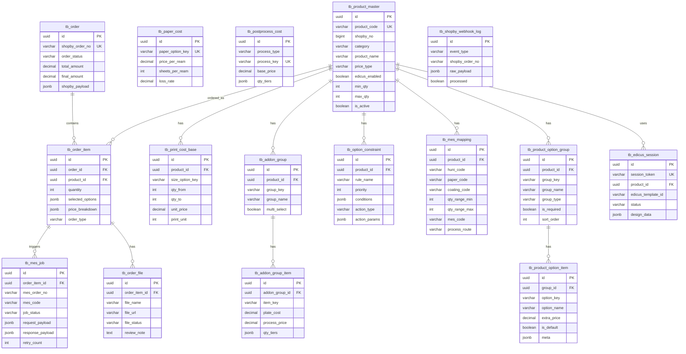

# 후니프린팅 인쇄자동견적 시스템 — DB 스키마 및 ERD

> **버전**: v1.0 | **작성일**: 2026-03-01 | **작성자**: 지니
> **분류**: 설계 문서 | **DB**: PostgreSQL (Neon Serverless)

---

## 1. 설계 원칙

- **단일 데이터베이스**: 모든 비즈니스 데이터를 하나의 PostgreSQL 인스턴스에서 관리
- **JSONB 활용**: 유연한 옵션/규칙 데이터는 JSONB 컬럼 사용 (인덱스 지원)
- **소프트 삭제**: `deleted_at` 컬럼으로 논리 삭제 (데이터 이력 보존)
- **타임스탬프**: 모든 테이블에 `created_at`, `updated_at` 기본 포함
- **UUID PK**: 분산 환경을 고려해 `uuid_generate_v4()` 사용

---

## 2. 테이블 목록

| 테이블명 | 설명 | 분류 |
|----------|------|------|
| `tb_product_master` | 상품 마스터 | 상품 |
| `tb_product_option_group` | 옵션 그룹 (사이즈/인쇄/용지 등) | 상품 |
| `tb_product_option_item` | 옵션 항목 (A4/단면/아트지 등) | 상품 |
| `tb_print_cost_base` | 출력비 기준 단가 (수량 구간별) | 가격 |
| `tb_paper_cost` | 용지비 기준 (연당가) | 가격 |
| `tb_postprocess_cost` | 후가공비 (코팅/오시/미싱 등) | 가격 |
| `tb_addon_group` | 추가상품 그룹 (박/형압/특수인쇄 등) | 가격 |
| `tb_addon_group_item` | 추가상품 항목 | 가격 |
| `tb_option_constraint` | 옵션 제약조건 규칙 (JSONB) | 규칙 |
| `tb_mes_mapping` | Shopby 옵션 → MES 코드 매핑 | 연동 |
| `tb_order` | 주문 마스터 | 주문 |
| `tb_order_item` | 주문 상품 상세 | 주문 |
| `tb_order_file` | 주문 파일 (PDF/Edicus) | 주문 |
| `tb_mes_job` | MES 생산 작업 이력 | 연동 |
| `tb_shopby_webhook_log` | Shopby Webhook 수신 로그 | 로그 |
| `tb_edicus_session` | Edicus 에디터 세션 | 연동 |

---

## 3. DDL (PostgreSQL)

### 3.1 Extension 및 공통 설정

```sql
-- UUID 생성 Extension
CREATE EXTENSION IF NOT EXISTS "uuid-ossp";
CREATE EXTENSION IF NOT EXISTS "pg_trgm"; -- 한글 검색용

-- 공통 업데이트 트리거 함수
CREATE OR REPLACE FUNCTION update_updated_at()
RETURNS TRIGGER AS $$
BEGIN
  NEW.updated_at = NOW();
  RETURN NEW;
END;
$$ LANGUAGE plpgsql;
```

---

### 3.2 상품 마스터 (`tb_product_master`)

```sql
CREATE TABLE tb_product_master (
  id              UUID PRIMARY KEY DEFAULT uuid_generate_v4(),
  product_code    VARCHAR(20) NOT NULL UNIQUE,      -- 상품코드 (예: P001-001)
  shopby_no       BIGINT,                            -- Shopby 상품번호
  category        VARCHAR(50) NOT NULL,              -- 카테고리 (디지털인쇄, 스티커, 실사 등)
  product_name    VARCHAR(200) NOT NULL,             -- 상품명
  price_type      VARCHAR(30) NOT NULL,              -- 가격 유형 (digital, sticker, sisa, acrylic, booklet, goods, calendar)
  edicus_enabled  BOOLEAN DEFAULT FALSE,             -- Edicus 에디터 주문 가능 여부
  edicus_template_id VARCHAR(100),                  -- Edicus 템플릿 ID
  min_qty         INT DEFAULT 1,                     -- 최소 주문 수량
  max_qty         INT DEFAULT 100000,                -- 최대 주문 수량
  qty_unit        INT DEFAULT 1,                     -- 수량 단위 (1, 10, 100 등)
  turnaround_days INT DEFAULT 3,                     -- 기본 제작 기간 (영업일)
  is_active       BOOLEAN DEFAULT TRUE,              -- 판매 활성화 여부
  sort_order      INT DEFAULT 0,                     -- 정렬 순서
  description     TEXT,                              -- 상품 설명
  created_at      TIMESTAMPTZ DEFAULT NOW(),
  updated_at      TIMESTAMPTZ DEFAULT NOW(),
  deleted_at      TIMESTAMPTZ
);

CREATE INDEX idx_product_master_category ON tb_product_master(category);
CREATE INDEX idx_product_master_active ON tb_product_master(is_active) WHERE deleted_at IS NULL;
CREATE TRIGGER trg_product_master_updated_at
  BEFORE UPDATE ON tb_product_master
  FOR EACH ROW EXECUTE FUNCTION update_updated_at();
```

---

### 3.3 옵션 그룹 (`tb_product_option_group`)

```sql
CREATE TABLE tb_product_option_group (
  id            UUID PRIMARY KEY DEFAULT uuid_generate_v4(),
  product_id    UUID NOT NULL REFERENCES tb_product_master(id) ON DELETE CASCADE,
  group_key     VARCHAR(50) NOT NULL,               -- 그룹 키 (size, print_side, paper, coating, finish 등)
  group_name    VARCHAR(100) NOT NULL,              -- 그룹명 (사이즈, 인쇄면, 용지, 코팅, 후가공)
  group_type    VARCHAR(30) NOT NULL DEFAULT 'select', -- 입력 유형 (select, multi_select, number, text)
  is_required   BOOLEAN DEFAULT TRUE,               -- 필수 선택 여부
  sort_order    INT DEFAULT 0,
  created_at    TIMESTAMPTZ DEFAULT NOW(),
  updated_at    TIMESTAMPTZ DEFAULT NOW(),
  UNIQUE(product_id, group_key)
);

CREATE INDEX idx_option_group_product ON tb_product_option_group(product_id);
```

---

### 3.4 옵션 항목 (`tb_product_option_item`)

```sql
CREATE TABLE tb_product_option_item (
  id              UUID PRIMARY KEY DEFAULT uuid_generate_v4(),
  group_id        UUID NOT NULL REFERENCES tb_product_option_group(id) ON DELETE CASCADE,
  option_key      VARCHAR(100) NOT NULL,             -- 항목 키 (A4, duplex, art100 등)
  option_name     VARCHAR(200) NOT NULL,             -- 항목명 (A4, 양면, 아트지 100g)
  option_value    VARCHAR(200),                      -- 계산에 쓰이는 실제 값
  extra_price     DECIMAL(12, 2) DEFAULT 0,          -- 추가 금액 (0이면 기본 가격)
  price_mode      VARCHAR(20) DEFAULT 'fixed',       -- 가격 방식 (fixed, rate, formula)
  is_default      BOOLEAN DEFAULT FALSE,             -- 기본 선택값
  is_active       BOOLEAN DEFAULT TRUE,
  sort_order      INT DEFAULT 0,
  meta            JSONB DEFAULT '{}',                -- 추가 메타데이터 (용지 평량, 코팅 방식 등)
  created_at      TIMESTAMPTZ DEFAULT NOW(),
  updated_at      TIMESTAMPTZ DEFAULT NOW()
);

CREATE INDEX idx_option_item_group ON tb_product_option_item(group_id);
CREATE INDEX idx_option_item_active ON tb_product_option_item(is_active);
```

---

### 3.5 출력비 기준 단가 (`tb_print_cost_base`)

```sql
CREATE TABLE tb_print_cost_base (
  id              UUID PRIMARY KEY DEFAULT uuid_generate_v4(),
  product_id      UUID NOT NULL REFERENCES tb_product_master(id) ON DELETE CASCADE,
  size_option_key VARCHAR(100) NOT NULL,             -- 사이즈 옵션 키
  qty_from        INT NOT NULL,                      -- 수량 구간 시작
  qty_to          INT NOT NULL,                      -- 수량 구간 끝 (0 = 무제한)
  unit_price      DECIMAL(12, 2) NOT NULL,           -- 장당 단가 (원)
  print_unit      INT DEFAULT 1,                     -- 판수 (1=단면, 2=양면)
  created_at      TIMESTAMPTZ DEFAULT NOW(),
  updated_at      TIMESTAMPTZ DEFAULT NOW(),
  CONSTRAINT chk_qty_range CHECK (qty_from <= qty_to OR qty_to = 0)
);

CREATE INDEX idx_print_cost_product ON tb_print_cost_base(product_id);
CREATE INDEX idx_print_cost_qty ON tb_print_cost_base(product_id, qty_from, qty_to);
```

---

### 3.6 용지비 기준 (`tb_paper_cost`)

```sql
CREATE TABLE tb_paper_cost (
  id              UUID PRIMARY KEY DEFAULT uuid_generate_v4(),
  paper_option_key VARCHAR(100) NOT NULL UNIQUE,    -- 용지 옵션 키 (art100, art150 등)
  paper_name      VARCHAR(200) NOT NULL,             -- 용지명
  price_per_ream  DECIMAL(12, 2) NOT NULL,           -- 연당가 (원/연, 2000장 기준)
  sheets_per_ream INT DEFAULT 2000,                  -- 연당 장수
  loss_rate       DECIMAL(4, 3) DEFAULT 1.300,       -- 로스율 (기본 1.3)
  created_at      TIMESTAMPTZ DEFAULT NOW(),
  updated_at      TIMESTAMPTZ DEFAULT NOW()
);

COMMENT ON COLUMN tb_paper_cost.loss_rate IS '용지비 = (연당가 / sheets_per_ream) × 판걸이수 × loss_rate';
```

---

### 3.7 후가공비 (`tb_postprocess_cost`)

```sql
CREATE TABLE tb_postprocess_cost (
  id              UUID PRIMARY KEY DEFAULT uuid_generate_v4(),
  process_type    VARCHAR(50) NOT NULL,              -- 후가공 유형 (coating, corner_cut, crease, perforation, variable)
  process_key     VARCHAR(100) NOT NULL UNIQUE,      -- 처리 키
  process_name    VARCHAR(200) NOT NULL,             -- 처리명
  price_type      VARCHAR(30) NOT NULL DEFAULT 'fixed', -- 가격 방식 (fixed, per_sheet, qty_range)
  base_price      DECIMAL(12, 2) DEFAULT 0,          -- 기본 가격
  price_per_sheet DECIMAL(10, 4) DEFAULT 0,          -- 장당 가격
  qty_tiers       JSONB DEFAULT '[]',                -- 수량별 가격 구간 [{qty_from, qty_to, price}]
  created_at      TIMESTAMPTZ DEFAULT NOW(),
  updated_at      TIMESTAMPTZ DEFAULT NOW()
);

CREATE INDEX idx_postprocess_type ON tb_postprocess_cost(process_type);
```

---

### 3.8 추가상품 그룹 (`tb_addon_group`)

```sql
CREATE TABLE tb_addon_group (
  id              UUID PRIMARY KEY DEFAULT uuid_generate_v4(),
  product_id      UUID NOT NULL REFERENCES tb_product_master(id) ON DELETE CASCADE,
  group_key       VARCHAR(100) NOT NULL,             -- 그룹 키 (foil_stamp, emboss 등)
  group_name      VARCHAR(200) NOT NULL,             -- 그룹명
  is_required     BOOLEAN DEFAULT FALSE,
  multi_select    BOOLEAN DEFAULT FALSE,             -- 복수 선택 가능 여부
  sort_order      INT DEFAULT 0,
  created_at      TIMESTAMPTZ DEFAULT NOW(),
  updated_at      TIMESTAMPTZ DEFAULT NOW(),
  UNIQUE(product_id, group_key)
);
```

---

### 3.9 추가상품 항목 (`tb_addon_group_item`)

```sql
CREATE TABLE tb_addon_group_item (
  id              UUID PRIMARY KEY DEFAULT uuid_generate_v4(),
  addon_group_id  UUID NOT NULL REFERENCES tb_addon_group(id) ON DELETE CASCADE,
  item_key        VARCHAR(100) NOT NULL,
  item_name       VARCHAR(200) NOT NULL,
  plate_cost      DECIMAL(12, 2) DEFAULT 0,          -- 동판/아연판비 (1회성)
  process_price   DECIMAL(12, 2) DEFAULT 0,          -- 가공비 (수량별 또는 고정)
  price_type      VARCHAR(30) DEFAULT 'fixed',       -- 가격 방식
  qty_tiers       JSONB DEFAULT '[]',
  is_default      BOOLEAN DEFAULT FALSE,
  sort_order      INT DEFAULT 0,
  created_at      TIMESTAMPTZ DEFAULT NOW(),
  updated_at      TIMESTAMPTZ DEFAULT NOW()
);

CREATE INDEX idx_addon_item_group ON tb_addon_group_item(addon_group_id);
```

---

### 3.10 옵션 제약조건 규칙 (`tb_option_constraint`)

```sql
-- 제약조건 유형 ENUM
CREATE TYPE constraint_action_type AS ENUM (
  'show_addon',      -- 추가상품 표시/숨김
  'filter_option',   -- 다른 옵션 필터링
  'require_option',  -- 특정 옵션 강제 선택
  'exclude_option',  -- 특정 옵션 배제
  'auto_add',        -- 옵션 자동 추가
  'show_message',    -- 안내 메시지 표시
  'change_price_mode', -- 가격 계산 방식 변경
  'set_default'      -- 기본값 변경
);

CREATE TABLE tb_option_constraint (
  id              UUID PRIMARY KEY DEFAULT uuid_generate_v4(),
  product_id      UUID NOT NULL REFERENCES tb_product_master(id) ON DELETE CASCADE,
  rule_name       VARCHAR(200) NOT NULL,             -- 규칙명 (사람이 읽을 수 있는 설명)
  priority        INT DEFAULT 0,                     -- 규칙 우선순위 (높을수록 먼저 적용)
  is_active       BOOLEAN DEFAULT TRUE,
  -- json-rules-engine 형식
  conditions      JSONB NOT NULL,                    -- { all: [...] } 또는 { any: [...] } 형식
  action_type     constraint_action_type NOT NULL,
  action_params   JSONB NOT NULL DEFAULT '{}',       -- 액션 파라미터
  message_text    VARCHAR(500),                      -- show_message 시 표시할 텍스트
  created_at      TIMESTAMPTZ DEFAULT NOW(),
  updated_at      TIMESTAMPTZ DEFAULT NOW()
);

-- JSONB 인덱스 (조건 검색 최적화)
CREATE INDEX idx_constraint_product ON tb_option_constraint(product_id);
CREATE INDEX idx_constraint_conditions ON tb_option_constraint USING GIN(conditions);
CREATE INDEX idx_constraint_active ON tb_option_constraint(is_active) WHERE is_active = TRUE;

-- 규칙 예시:
-- 조건: 코팅 = "무광코팅" AND 후가공 = "UV코팅" 선택 불가
-- conditions: { "all": [{ "fact": "coating", "operator": "equal", "value": "matte" }] }
-- action_type: exclude_option
-- action_params: { "group": "uv_coating", "keys": ["uv_all"] }
```

---

### 3.11 MES 매핑 테이블 (`tb_mes_mapping`)

```sql
CREATE TABLE tb_mes_mapping (
  id              UUID PRIMARY KEY DEFAULT uuid_generate_v4(),
  product_id      UUID REFERENCES tb_product_master(id),
  huni_code       VARCHAR(50) NOT NULL,              -- 후니프린팅 상품코드
  paper_code      VARCHAR(50) NOT NULL DEFAULT 'NONE', -- 용지 코드
  coating_code    VARCHAR(50) NOT NULL DEFAULT 'NONE', -- 코팅 코드
  qty_range_min   INT NOT NULL DEFAULT 1,
  qty_range_max   INT NOT NULL DEFAULT 99999,
  mes_code        VARCHAR(200) NOT NULL,             -- MES 작업 코드
  process_route   VARCHAR(500),                      -- 공정 경로
  status          VARCHAR(20) DEFAULT 'active',      -- active, inactive
  note            TEXT,
  created_at      TIMESTAMPTZ DEFAULT NOW(),
  updated_at      TIMESTAMPTZ DEFAULT NOW()
);

CREATE UNIQUE INDEX idx_mes_mapping_unique ON tb_mes_mapping(huni_code, paper_code, coating_code, qty_range_min, qty_range_max);
CREATE INDEX idx_mes_mapping_huni ON tb_mes_mapping(huni_code);
CREATE INDEX idx_mes_mapping_qty ON tb_mes_mapping(huni_code, qty_range_min, qty_range_max);
```

---

### 3.12 주문 마스터 (`tb_order`)

```sql
CREATE TYPE order_status AS ENUM (
  'pending',       -- 결제 대기
  'paid',          -- 결제 완료
  'file_wait',     -- 파일 검수 대기
  'file_ok',       -- 파일 검수 통과
  'mes_sent',      -- MES 전송 완료
  'producing',     -- 생산 중
  'shipped',       -- 배송 중
  'completed',     -- 완료
  'cancelled'      -- 취소
);

CREATE TABLE tb_order (
  id              UUID PRIMARY KEY DEFAULT uuid_generate_v4(),
  shopby_order_no VARCHAR(50) NOT NULL UNIQUE,       -- Shopby 주문번호
  shopby_member_id VARCHAR(100),                     -- Shopby 회원 ID
  order_status    order_status NOT NULL DEFAULT 'pending',
  total_amount    DECIMAL(14, 2) NOT NULL,           -- 총 주문 금액
  discount_amount DECIMAL(14, 2) DEFAULT 0,          -- 할인 금액
  final_amount    DECIMAL(14, 2) NOT NULL,           -- 최종 결제 금액
  shopby_payload  JSONB,                             -- Shopby Webhook 원본 데이터
  paid_at         TIMESTAMPTZ,
  created_at      TIMESTAMPTZ DEFAULT NOW(),
  updated_at      TIMESTAMPTZ DEFAULT NOW()
);

CREATE INDEX idx_order_shopby_no ON tb_order(shopby_order_no);
CREATE INDEX idx_order_status ON tb_order(order_status);
CREATE INDEX idx_order_created ON tb_order(created_at DESC);
```

---

### 3.13 주문 상품 상세 (`tb_order_item`)

```sql
CREATE TABLE tb_order_item (
  id              UUID PRIMARY KEY DEFAULT uuid_generate_v4(),
  order_id        UUID NOT NULL REFERENCES tb_order(id) ON DELETE CASCADE,
  product_id      UUID REFERENCES tb_product_master(id),
  shopby_item_no  VARCHAR(50),                       -- Shopby 주문 상품번호
  product_name    VARCHAR(200) NOT NULL,
  quantity        INT NOT NULL,
  -- 선택된 옵션 (견적 당시 스냅샷)
  selected_options JSONB NOT NULL DEFAULT '{}',      -- { size: "A4", coating: "matte", ... }
  -- 가격 내역
  price_breakdown JSONB NOT NULL DEFAULT '{}',       -- { print_cost, paper_cost, postprocess, addon, total }
  unit_price      DECIMAL(12, 2) NOT NULL,
  total_price     DECIMAL(12, 2) NOT NULL,
  -- 주문 방식
  order_type      VARCHAR(20) NOT NULL DEFAULT 'pdf', -- pdf, edicus
  edicus_session_id UUID,                            -- Edicus 세션 ID (edicus 주문 시)
  created_at      TIMESTAMPTZ DEFAULT NOW(),
  updated_at      TIMESTAMPTZ DEFAULT NOW()
);

CREATE INDEX idx_order_item_order ON tb_order_item(order_id);
CREATE INDEX idx_order_item_product ON tb_order_item(product_id);
```

---

### 3.14 주문 파일 (`tb_order_file`)

```sql
CREATE TYPE file_status AS ENUM (
  'uploaded',    -- 업로드 완료
  'reviewing',   -- 검수 중
  'approved',    -- 승인
  'rejected'     -- 반려
);

CREATE TABLE tb_order_file (
  id              UUID PRIMARY KEY DEFAULT uuid_generate_v4(),
  order_item_id   UUID NOT NULL REFERENCES tb_order_item(id) ON DELETE CASCADE,
  file_name       VARCHAR(500) NOT NULL,
  file_url        VARCHAR(1000) NOT NULL,            -- 저장 URL (S3/R2 등)
  file_size       BIGINT,                            -- 파일 크기 (bytes)
  file_type       VARCHAR(50),                       -- pdf, ai, jpg 등
  file_status     file_status DEFAULT 'uploaded',
  review_note     TEXT,                              -- 검수 메모
  reviewed_by     VARCHAR(100),                      -- 검수자
  reviewed_at     TIMESTAMPTZ,
  created_at      TIMESTAMPTZ DEFAULT NOW(),
  updated_at      TIMESTAMPTZ DEFAULT NOW()
);

CREATE INDEX idx_order_file_item ON tb_order_file(order_item_id);
```

---

### 3.15 MES 생산 작업 이력 (`tb_mes_job`)

```sql
CREATE TYPE mes_job_status AS ENUM (
  'pending',     -- 전송 대기
  'sent',        -- MES 전송 완료
  'accepted',    -- MES 접수
  'failed',      -- 전송 실패
  'retrying'     -- 재시도 중
);

CREATE TABLE tb_mes_job (
  id              UUID PRIMARY KEY DEFAULT uuid_generate_v4(),
  order_item_id   UUID NOT NULL REFERENCES tb_order_item(id),
  mes_order_no    VARCHAR(100),                      -- MES에서 반환한 작업번호
  mes_code        VARCHAR(200) NOT NULL,             -- 사용된 MES 코드
  job_status      mes_job_status DEFAULT 'pending',
  request_payload JSONB NOT NULL,                   -- MES 전송 데이터
  response_payload JSONB,                           -- MES 응답 데이터
  error_message   TEXT,
  retry_count     INT DEFAULT 0,
  sent_at         TIMESTAMPTZ,
  accepted_at     TIMESTAMPTZ,
  created_at      TIMESTAMPTZ DEFAULT NOW(),
  updated_at      TIMESTAMPTZ DEFAULT NOW()
);

CREATE INDEX idx_mes_job_order_item ON tb_mes_job(order_item_id);
CREATE INDEX idx_mes_job_status ON tb_mes_job(job_status);
```

---

### 3.16 Shopby Webhook 로그 (`tb_shopby_webhook_log`)

```sql
CREATE TABLE tb_shopby_webhook_log (
  id              UUID PRIMARY KEY DEFAULT uuid_generate_v4(),
  event_type      VARCHAR(100) NOT NULL,             -- ORDER_COMPLETE, ORDER_CANCEL 등
  shopby_order_no VARCHAR(50),
  raw_payload     JSONB NOT NULL,                   -- Webhook 원본 데이터
  processed       BOOLEAN DEFAULT FALSE,
  processed_at    TIMESTAMPTZ,
  error_message   TEXT,
  received_at     TIMESTAMPTZ DEFAULT NOW()
);

CREATE INDEX idx_webhook_log_order ON tb_shopby_webhook_log(shopby_order_no);
CREATE INDEX idx_webhook_log_processed ON tb_shopby_webhook_log(processed);
CREATE INDEX idx_webhook_log_received ON tb_shopby_webhook_log(received_at DESC);
```

---

### 3.17 Edicus 에디터 세션 (`tb_edicus_session`)

```sql
CREATE TABLE tb_edicus_session (
  id              UUID PRIMARY KEY DEFAULT uuid_generate_v4(),
  session_token   VARCHAR(200) NOT NULL UNIQUE,      -- Edicus 세션 토큰
  product_id      UUID REFERENCES tb_product_master(id),
  edicus_template_id VARCHAR(100),
  edicus_order_no VARCHAR(100),                      -- Edicus 측 주문번호
  member_id       VARCHAR(100),
  status          VARCHAR(30) DEFAULT 'created',     -- created, editing, completed, expired
  design_data     JSONB,                             -- 완성된 디자인 데이터
  preview_url     VARCHAR(1000),                     -- 미리보기 이미지 URL
  expires_at      TIMESTAMPTZ,
  completed_at    TIMESTAMPTZ,
  created_at      TIMESTAMPTZ DEFAULT NOW(),
  updated_at      TIMESTAMPTZ DEFAULT NOW()
);

CREATE INDEX idx_edicus_session_token ON tb_edicus_session(session_token);
CREATE INDEX idx_edicus_session_product ON tb_edicus_session(product_id);
```

---

## 4. ERD (Mermaid)



---

## 5. 가격 계산 로직 (SQL 예시)

```sql
-- 자동견적 계산 함수 (개념 예시)
-- 실제 구현은 애플리케이션 레이어에서 json-rules-engine 사용

-- 출력비 조회 (수량 구간 매칭)
SELECT unit_price * print_unit AS print_cost_per_sheet
FROM tb_print_cost_base
WHERE product_id = $1
  AND size_option_key = $2
  AND qty_from <= $3
  AND (qty_to >= $3 OR qty_to = 0)
LIMIT 1;

-- 용지비 계산
-- 용지비 = (price_per_ream / sheets_per_ream) × 판걸이수 × loss_rate
SELECT (price_per_ream / sheets_per_ream) * $판걸이수 * loss_rate AS paper_cost
FROM tb_paper_cost
WHERE paper_option_key = $paper_key;

-- MES 코드 매핑 조회
SELECT mes_code, process_route
FROM tb_mes_mapping
WHERE huni_code = $1
  AND paper_code = $2
  AND coating_code = $3
  AND qty_range_min <= $4
  AND qty_range_max >= $4
LIMIT 1;
```

---

## 6. 데이터 마이그레이션 계획

### 6.1 기존 데이터 소스

| 소스 | 형식 | 데이터 | 마이그레이션 대상 |
|------|------|--------|------------------|
| `huni_master_v2.db` | SQLite | 192개 상품, 16개 가격표 | `tb_product_master`, `tb_print_cost_base` |
| `mes-mapping-data.json` | JSON | 17,095개 매핑 | `tb_mes_mapping` |
| 제약조건 엑셀 | Excel | 156개 제약 레코드 | `tb_option_constraint` |

### 6.2 마이그레이션 우선순위

```
Phase 1 (Day 1-3): 상품 마스터 + 옵션 기본 구조
Phase 2 (Day 4-6): 가격 기준 데이터 (출력비, 용지비, 후가공비)
Phase 3 (Day 7-9): MES 매핑 데이터 (17,095건)
Phase 4 (Day 10-12): 옵션 제약조건 규칙 변환 (156건)
```

### 6.3 데이터 품질 이슈 (사전 해결 필요)

| P0 우선순위 | 문제 | 대상 상품 |
|-------------|------|-----------|
| P0 | 옵션값에 안내문 포함 ("무지: 주문불가") | 굿즈 일부 |
| P1 | 제약조건 마커가 옵션 데이터에 혼재 | 스티커 |
| P2 | 가격표 누락 (빈 가격표) | 캘린더 일부 |

---

*본 스키마는 설계 초안이며, 프로젝트 리더 미팅 후 확정 예정입니다.*
